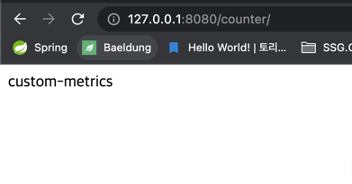

## 의존성 추가 (gradle)

````gradle
// actuator
implementation 'org.springframework.boot:spring-boot-starter-actuator'
// micrometer
implementation 'io.micrometer:micrometer-registry-prometheus'
````

- actuator
  - spring boot 어플리케이션 정보 제공
- micrometer
  - prometheus 가 읽을 수 있는 metrics 정보를 제공하는 역할

## actuator 설정 (applications.yml 설정)

> management.endpoints.web.exposure.include 옵션을 통해 /actuator 페이지를 통해 노출할 엔드포인트 설정

````yml
management:
  server:
    port: 8082
  endpoints:
    prometheus:
      enabled: true
    web:
      exposure:
        include: prometheus
````

> 설정 후 spring boot 실행 시, base path '/actuator' 추가 확인

````shell
2023-03-17 21:58:13.527  INFO 27850 --- [  restartedMain] o.s.b.a.e.web.EndpointLinksResolver      : Exposing 1 endpoint(s) beneath base path '/actuator'
````

> http://127.0.0.1:8082/actuator - End-Point 확인

- _links 하위에 management.endpoints.web.exposure.include 에서 정의한 항목 확인 가능

````json
{
    "_links": {
        "self": {
            "href": "http://127.0.0.1:8082/actuator",
            "templated": false
        },
        "prometheus": {
            "href": "http://127.0.0.1:8082/actuator/prometheus",
            "templated": false
        }
    }
}
````

> http://127.0.0.1:8080/actuator/prometheus - End-Point 확인

````plaintext
# HELP jvm_threads_daemon_threads The current number of live daemon threads
# TYPE jvm_threads_daemon_threads gauge
jvm_threads_daemon_threads 21.0
# HELP system_cpu_count The number of processors available to the Java virtual machine
# TYPE system_cpu_count gauge
system_cpu_count 10.0
````

- 주석이 아닌 부분인 jvm_threads_daemon_threads, system_cpu_count 는 각각이 prometheus 가 인식할 수 있는 metrics
- 각각의 metrics 위에 HELP(도움말), TYPE 확인 가능

## prometheus 설치 및 실행

> brew install prometheus


> brew services start prometheus


> http://localhost:9090 접속 (prometheus 대시보드)


## grafana 설치

> brew install grafana


> brew services start grafana


> http://localhost:3000/login 접속 (grafana - admin/admin)


> Configuration > Add data source 클릭


> Prometheus 클릭


> Prometheus - URL 입력 (http://localhost:9090)


> prometheus.yml 파일 설정 추가

- 위치 : /opt/homebrew/etc/prometheus.yml
- 편집 : vi prometheus.yml
- 설정 후 prometheus 재시작
  - brew services restart prometheus

````yml
global:
  scrape_interval: 15s

scrape_configs:
  - job_name: "prometheus"
    static_configs:
    - targets: ["localhost:9090"]
  # springboot 로 제공할 actuator 의 End-Point 인 localhost:8082/actuator/prometheus 를 5초 간격으로 스크래핑
  - job_name: 'spring-actuator'
    metrics_path: '/actuator/prometheus'
    scrape_interval: 5s
    static_configs:
    - targets: ['localhost:8082']
````


> prometheus > Status 탭 > Targets 확인

- prometheus.yml 에 추가한 job_name : spring-actuator 확인


- spring boot 실행 전, State : down


- spring boot 실행 후, State : up

> prometheus > Graph 탭 (수집 데이터 확인)

- http://127.0.0.1:8082/actuator/prometheus - End-Point 를 스크래핑하여 수집한 데이터 확인
- system_cpu_count 입력 및 Execute


- 입력 결과


## grafana 패널 셋팅

> grafana > Dashboards > New dashboard


> Add a new panel


> 패널 구성 초기 화면


> 패널 셋팅

- Visualizations > Time series


- 패널 타이틀 및 설명 작성


- Metrics 선택 및 Label 조건 설정
  - Metrics : http://127.0.0.1:8082/actuator/prometheus 에서 제공하는 #HELP, #TYPE 밑 데이터
    - jvm_memory_used_bytes
  - Label : { } (중괄호) 안 key 값과 job, instance
    - area, id
  - job
  - instance

````shell
# HELP jvm_memory_used_bytes The amount of used memory
# TYPE jvm_memory_used_bytes gauge
jvm_memory_used_bytes{area="heap",id="G1 Survivor Space",} 1.2582912E7
jvm_memory_used_bytes{area="heap",id="G1 Old Gen",} 2414872.0
jvm_memory_used_bytes{area="nonheap",id="Metaspace",} 4.1334584E7
jvm_memory_used_bytes{area="nonheap",id="CodeHeap 'non-nmethods'",} 1119360.0
jvm_memory_used_bytes{area="heap",id="G1 Eden Space",} 2.32783872E8
jvm_memory_used_bytes{area="nonheap",id="Compressed Class Space",} 5234048.0
jvm_memory_used_bytes{area="nonheap",id="CodeHeap 'non-profiled nmethods'",} 1.1625984E7
````


> 패널 적용 (우측 상단 Apply 버튼 클릭)


## Custom Metrics 수집 (라이브러리 사용)

````java
import java.util.List;

import org.springframework.web.bind.annotation.GetMapping;
import org.springframework.web.bind.annotation.RestController;

import io.micrometer.core.instrument.Metrics;
import io.micrometer.core.instrument.Tag;

@RestController
public class CustomMetricsController {

    @GetMapping("/counter")
    public String counter() {
        List<Tag> tags = List.of(Tag.of("custom_label_a", "A"), Tag.of("custom_label_b", "B"));
        Metrics.counter("custom.count.label", tags).increment(); // . 은 _ 로 변환

        return "custom-metrics";
    }
}
````

> http://127.0.0.1:8080/counter 호출



> http://127.0.0.1:8082/actuator/prometheus 접속 및 Custom Metrics 추가 확인

````shell
# HELP custom_count_label_total
# TYPE custom_count_label_total counter
custom_count_label_total{custom_label_a="A",custom_label_b="B",} 1.0
````


> prometheus metrics 추가 확인


> grafana 수집 확인


